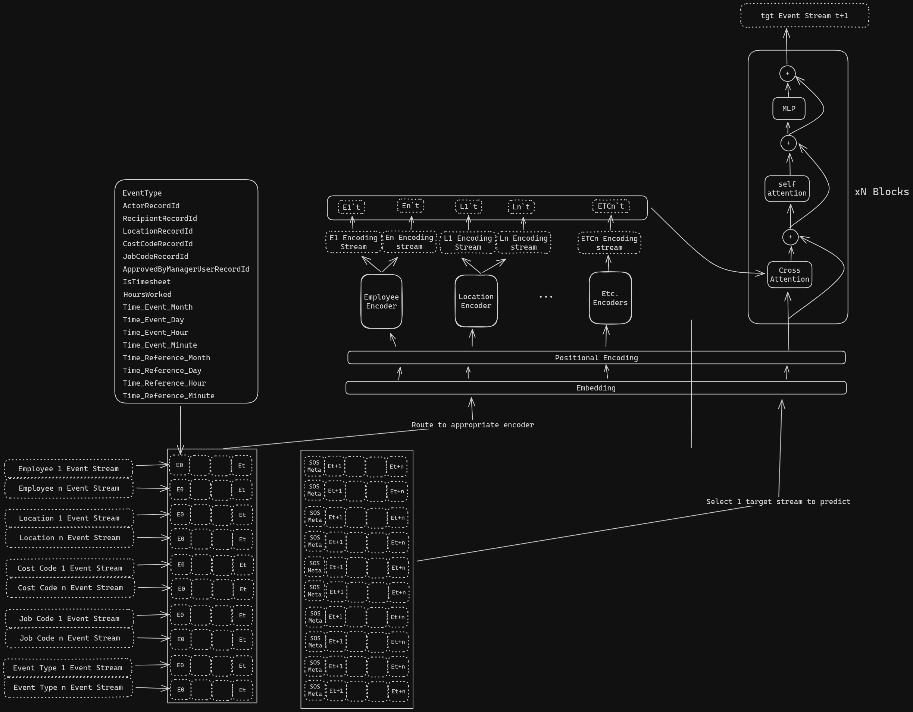

# PyTorch Event Stream Prediction Model
### Overview
This repository contains my implementation of a transformer-based event stream prediction model for the PyTorch Model Challenge. The model processes multiple event streams (Employee, Location, Cost Code, etc.) to predict future events by learning entity state representations.
### Architecture Highlights

* Multiple transformer encoders for different event types
* Cross-attention mechanism between encoded states and target sequences
* Event-specific embeddings with positional encoding
* Efficient last-vector-only approach as per requirements
* Scalable design supporting various event categories

### **Local Setup Modifications**
#### **Docker Configuration Changes**
The original setup was modified for local CPU training with the following key changes in docker-compose.yml:

* Added TensorBoard as a separate service for real-time monitoring
* IPC host mode enabled for better inter-process communication
* GPU configuration commented out for CPU-only training
* Shared volume (training_runs) between training and TensorBoard services
``` bash
services:
  model_tensorboard:
    container_name: model_tensorboard
    command: tensorboard --logdir /runs --host 0.0.0.0
    ports:
      - "6006:6006"
  
  model_training:
    container_name: model_training
    command: python -m modeling.train_model
    ipc: host  # Improved performance for CPU training
```
### Code Modifications for CPU Training

* **DataLoader optimization**: Set num_workers=0 to avoid multiprocessing overhead
* **Memory optimization**: Disabled persistent_workers
* **Precision adjustment**: Changed from bfloat16 to float32 for CPU compatibility
* **Learning rate**: Reduced to 1e-5 for stable convergence

### Quick Start
``` bash
# Build and run both services
docker-compose up --build

# Access TensorBoard at http://localhost:6006
# Training logs are automatically available in TensorBoard
```



