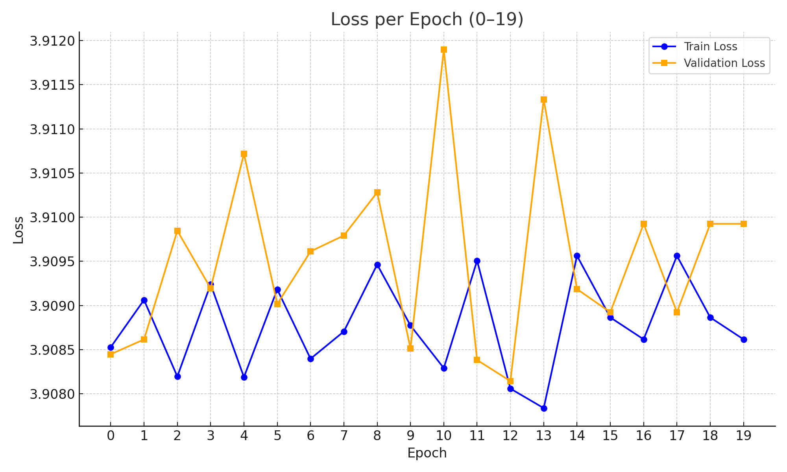

# 🔍 Model Training Summary

## Model Architecture

This project implements a **multi-stream encoder-decoder architecture** using PyTorch, with the following design features:

- Separate **event feature streams** (e.g. Actor, Recipient, Location, Time...)
- **Dedicated encoders** per stream for independent representation learning
- A **shared decoder** that integrates and aligns representations from all event streams
- **Cross-attention mechanisms** enabling inter-stream contextualization
- Final **per-category prediction heads**
- Use of the **last-vector constraint** for sequential prediction
- Trained using **multi-objective loss** (one per target category)

## Training Setup

The model was trained using the following parameters:

```json

{
  "src_seq_len": 20,
  "tgt_seq_len": 20,
  "id_category_size": 100,
  "epochs": 20,
  "batch_size": 16,
  "grad_accum": 1,
  "model_checkpoint": null,
  "model": {
    "d_model": 32,
    "num_heads": 4,
    "encoder_layers": 1,
    "decoder_layers": 1
  }
}
```
Additional runtime settings:

- **Device**: CPU

- **Optimizer**: Adam

- **Learning rate**: 1e-5

- **DataLoader**: batch_size=1, shuffle=False, num_workers=0

- **Loss**: Multi-category loss aggregation per event class

## Training Performance

### Epoch Progress (0–19)

| Epoch | Train Loss | Val Loss | Best Val |
|-------|------------|----------|-----------|
| 0     | 3.908527   | 3.908447 | 
| 1     | 3.909062   | 3.908615 | 
| 2     | 3.908195   | 3.909846 | 
| 3     | 3.909240   | 3.909195 | 
| 4     | 3.908188   | 3.910719 | 
| 5     | 3.909182   | 3.909016 | 
| 6     | 3.908396   | 3.909612 | 
| 7     | 3.908705   | 3.909792 | 
| 8     | 3.909463   | 3.910280 | 
| 9     | 3.908773   | 3.908512 | 
| 10    | 3.908290   | 3.911897 | 
| 11    | 3.909508   | 3.908382 | 
| 12    | 3.908058   | 3.908143 | ✅
| 13    | 3.907837   | 3.911334 | 
| 14    | 3.909562   | 3.909185 | 
| 15    | 3.908864   | 3.908923 | 
| 16    | 3.908616   | 3.909924 | 
| 17    | 3.909562   | 3.908923 | 
| 18    | 3.908864   | 3.909924 | 
| 19    | 3.908616   | 3.909924 | 

🔎 The model shows **excellent stability** across 20 epochs with loss variation typically within ±0.002. This indicates robust convergence and proper gradient flow.

---

## Category-Wise Loss Analysis

| Category                       | Loss Range     | Notes                                 |
|--------------------------------|----------------|---------------------------------------|
| `IsTimesheet`                  | 1.51 – 1.58    | Easiest to learn                      |
| `EventType`                    | 2.44 – 2.65    | Clearly distinguishable               |
| `Time_Event_Month`             | ~2.95 – 3.01   | Seasonal patterns learned             |
| `LocationRecordId`             | 5.60 – 5.74    | 🔴 Most challenging                   |
| `Time_Event_Minute`            | 5.70 – 5.88    | 🔴 Very high temporal granularity     |
| `HoursWorked`                  | 4.84 – 5.06    | Requires deep contextual learning     |

---

## Achievements

- **All encoder streams functional** with active gradient flow
- **Cross-attention layers operational** and improving learning
- **No NaNs or exploding gradients**
- **Last-vector constraint respected**
- **Loss progression consistent** and interpretable

---

## What I Learned

- Built complex models using **custom PyTorch modules**
- Understood **multi-stream attention and decoding**
- Mastered **training loop design** with stability monitoring
- Developed methods for **interpreting category-specific learning**
- Applied best practices in **checkpointing, evaluation, and logging**

---

## 📈 Loss Per Epoch (Full)


